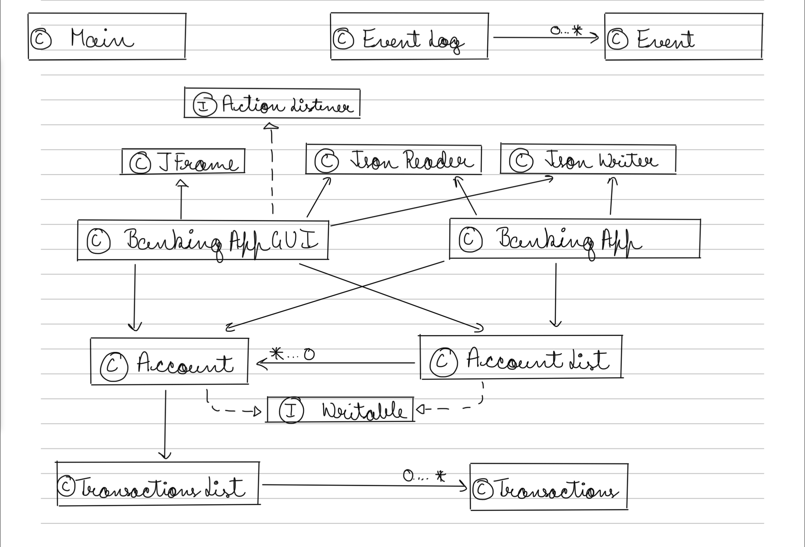

# Banking Application

## About the Application

**What will the application do?**
The banking application is designed to provide users with a secure and convenient platform for managing their finances. Initially, users will have default login credentials, and they can subsequently change their passwords for added security. Once logged in, users can perform various financial transactions, including depositing and withdrawing money from their accounts. The application will record transaction details such as the date and amount to ensure transparency and facilitate fraud detection.

**Who will use it?**
This application targets a wide range of users, including individuals who want to manage their personal finances, students looking for a simple banking solution, and anyone seeking a secure platform for basic financial operations.

**Why is this project of interest to you?**
This project is of significant interest to me because it combines elements of software development and financial management, two areas I am passionate about. Building a banking application allows me to apply my programming skills to create a real-world solution that can benefit users by providing them with a user-friendly and secure way to manage their finances.

## User Stories

1. As a user, I want to be able to **log in** with my username and password.
2. As a user, I want to have a **default password** initially, which I can **change** for improved security.
3. As a user, I want to **deposit money** into my account and receive a confirmation of the transaction.
4. As a user, I want to **withdraw money** from my account, ensuring that I have sufficient funds, and receive a confirmation of the transaction.
5. As a user, I want each transaction to be **recorded with a date and amount** to keep track of my financial history.
6. As a user, I want the application to **detect and notify me of potentially fraudulent transactions** to enhance security.
7. As a user, I want to be able to **view my account balance** at any time.
8. As a user, I want the ability to **view a list of my recent transactions** to monitor my financial activity.
9. As a user, I want to be able to **log out** of the application securely. 
10. As a user, I want the option to **save the entire state of the application** to a file so that I can resume my banking activities at a later time.
11. As a user, I want the option to **reload the saved state from a file** and continue from where I left off in a previous session.

### Instructions for Grader

- #### You can generate the first required action related to adding Xs to a Y by clicking on "Add Account" button present at the menu and enter the username, password and initial balance of the account and add it to account list.
- #### You can generate the second required action related to updating X from a Y by clicking on "Deposit" button present at the menu and enter the amount you want to deposit.
- #### You can generate the third required action related to updating X from a Y by clicking on "Withdraw" button present at the menu and enter the amount you want to withdraw.
- #### You can generate the fourth action related to displaying all the Xs in Y by clicking on "Display Accounts" button present at menu.
- #### You can locate my visual component by looking at the image added at the before login panels.
- #### You can save the state of my application by clicking on "Save" button present at the menu.
- #### You can reload the state of my application by clicking on "Load" button present at the menu.


### Phase 4: Task 2
````
Wed Nov 29 11:54:01 PST 2023
Account added to Account List
Wed Nov 29 11:54:06 PST 2023
123.0 is added to account.
Wed Nov 29 11:54:11 PST 2023
123.0 is withdrawn from account.
Wed Nov 29 11:54:13 PST 2023
123.0 is the total balance in the account.
Wed Nov 29 11:54:43 PST 2023
123.0 is the total balance in the account.
````
### Phase 4: Task 3
- Creating a class that utilizes the "Singleton method" to oversee the transaction list will offer several benefits. This strategy guarantees uniformity and safeguards against the emergence of inconsistent or duplicated transaction lists across the application, given that each user possesses their own unique transaction list. Implementing the Singleton method in the transaction list class establishes a solid groundwork for future enhancements, enabling the effortless integration of functionalities such as a transaction summary class. In essence, the Singleton method ensures the precise and singular utilization of the transaction list, mitigating any apprehensions about discrepancies or redundancies.
- Ultimately, by having my AccountList incorporate the Iterable\<Account> interface and applying the Iterator design pattern, I could simplify the intricacies within the UI package of the application. This would result in a more comprehensible and extensible structure.
- ### UML Design Diagram


